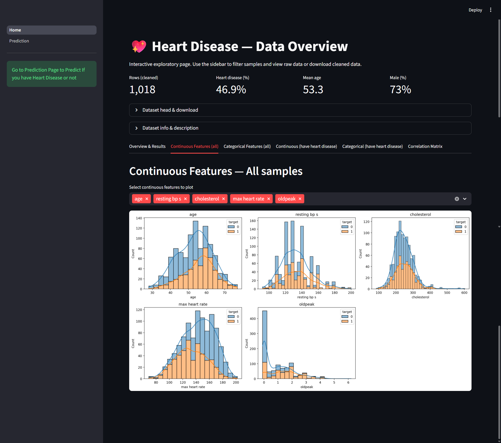

# Heart Disease Prediction — Web App

A compact Streamlit web application for exploring a heart-disease dataset and predicting the presence of heart disease for a patient using a trained model. The app provides interactive EDA, clear KPIs, visualizations, and a prediction page with model evaluation metrics.

---

## Live demo
A deployed demo will run the full interactive UI: dataset overview, EDA tabs, and the prediction page with model metrics and patient-level prediction.  
Link: 

---

## Screenshots

- Dashboard / Overview  
  

- Continuous / Categorical feature tabs  
  

- Prediction page & model metrics  
  

---

## Key features
- Cleaned dataset preview with download option
- Top KPIs (rows, mean age, % male, heart-disease prevalence)
- Tabbed EDA:
  - Continuous features (distribution by target)
  - Categorical features (counts by target)
  - Subset views for patients with heart disease
  - Correlation matrix
- Prediction page:
  - Patient-level inputs with intuitive controls
  - On-demand prediction using a saved model
  - Model performance metrics (Accuracy, Precision, Recall, F1, ROC AUC)
  - Graceful handling of missing/corrupted model artifacts (retrain fallback)
- Explanatory text and expandable metric definitions for non-technical users

---

## Dataset
The app expects a CSV dataset (named `dataset.csv`) with a `target` column (0 = no disease, 1 = disease) and typical clinical features such as:
- age
- sex
- chest pain type
- resting bp s
- cholesterol
- fasting blood sugar
- resting ecg
- max heart rate
- exercise angina
- oldpeak
- ST slope

Notes:
- The app removes implausible rows (examples: resting BP < 75, cholesterol == 0) during cleaning; adjust logic if your dataset has different conventions.

---

## Model & evaluation
- Model: RandomForestClassifier
- Preprocessing: StandardScaler on numeric features
- Stored artifacts : `model.pkl`, `evaluation.pkl`
- Shown evaluation metrics:
  - Accuracy — overall correctness
  - Precision — correctness among predicted positives
  - Recall (sensitivity) — fraction of real positives captured
  - F1 Score — harmonic mean of precision & recall
  - ROC AUC — separability of classes

Why these matter: for medical screening, balance recall and precision carefully (recall minimizes missed cases; precision reduces false alarms).

---

## How it works (brief)
1. Load dataset and apply light cleaning (remove obvious outliers/missing-value encodings).
2. Show KPIs and interactive EDA in separate tabs for clarity.
3. Load pre-trained model artifacts.
4. Prediction page converts UI selections into model-ready features (encodings + scaling) and returns prediction + metrics.

---

## Project structure (important files)
- Home.py — main dashboard / EDA (root)
- pages/Prediction.py — interactive prediction page + metrics
- dataset.csv — source data used for EDA and training
- model.pkl, scaler.pkl, evaluation.pkl — optional saved artifacts
- Screenshot/ — screenshots and static images

---

## Credits
- Author: Shaurya Srivastava